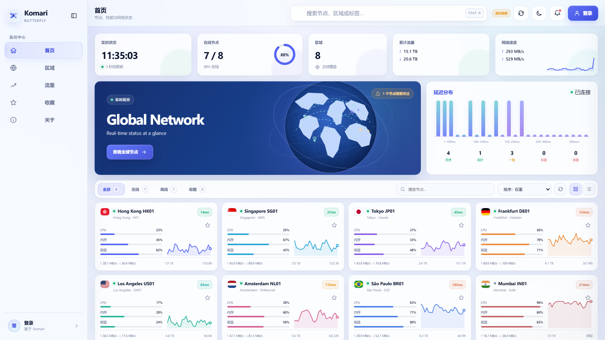

# Komari Butterfly

[简体中文](README.zh-CN.md) · English

A clean, responsive theme for [Komari Monitor](https://github.com/komari-monitor/komari), inspired by WinUI 3 and Mica materials.



## Highlights

- Layered Mica surfaces, restrained shadows, clear WinUI-style states, and five accent colors.
- A tonal navy dark mode keeps search fields, controls, cards, and dialogs consistently dark instead of introducing bright white surfaces.
- The **View global nodes** action opens a draggable globe with illuminated online, mixed, and offline regions. Select a region to focus it, inspect its local nodes, and open a node drawer.
- Geographic placement accepts exact ISO alpha-2 region codes or a leading flag emoji, aggregates at country/region level, and never infers a city location.
- Live metrics, latency distribution, region summaries, traffic charts, favorites, grid/list modes, and a node detail drawer.
- Native Komari JSON-RPC 2.0 integration with no external runtime JavaScript, CSS, map, or geolocation services.
- Managed theme settings for color mode, accent, density, corners, background, polling, sorting, visibility, copy, and footer.
- Phones use a compact command bar, horizontally snapping KPI cards, sticky node controls, and direction-aware bottom navigation that leaves the content area while scrolling or while the on-screen keyboard is active. Search opens node results immediately, while live refreshes preserve focus and scroll position.
- Node details become a safe-area-aware, swipe-to-dismiss bottom sheet with denser metrics and hardware information; the globe uses a full-screen region carousel, momentum-based touch rotation, and a lower-cost rendering profile.
- Short portrait screens receive a reduced-height overview and globe stage; 320 × 568-class screens omit only the large hero while retaining KPI cards, placing filters and the first node clear of the floating navigation.
- Keyboard search, reduced-motion support, short-landscape layouts, and English, Simplified Chinese, and Japanese interface copy.

## Install

1. Download `komari-butterfly-v1.5.0.zip` from GitHub Releases.
2. Open the Komari admin panel and upload the ZIP in theme management.
3. Select **Komari Butterfly** and save.

The release ZIP keeps the Komari theme contract at its root:

```text
komari-theme.json
preview.png
dist/
  index.html
  favicon.svg
  assets/
    app.js
    region-data.js
    world-data.js
    styles.css
```

## Local preview

```bash
npm run build
python3 -m http.server 4173 --directory dist
```

Open `http://127.0.0.1:4173/?demo=1`. Use `?demo=1&theme=dark` for the dark preview and `?demo=1&theme=dark&globe=1` to open the globe directly.

Demo mode is enabled only by the explicit `demo=1` query or by opening the page through `file://`. An API failure never silently replaces live data with demo nodes.

## Build, validate, and package

```bash
npm run check
npm run package
```

The package command creates:

```text
release/komari-butterfly-v1.5.0.zip
release/komari-butterfly-v1.5.0.zip.sha256
```

## Release

Update `version` in `komari-theme.json`, commit the change, create the matching tag, and push it:

```bash
git tag v1.5.0
git push origin main --tags
```

The release workflow validates the tag against the manifest version, builds the theme, creates the ZIP and SHA256 file, and attaches both to the GitHub Release.

## Configuration

All settings are declared in `komari-theme.json` and managed through the Komari admin panel. The theme reads the exact `theme_settings` object returned by Komari public settings and applies only declared values.

See [Design notes](docs/DESIGN.md) for the layout system and visual decisions.

## License

MIT © TomorrowX6
