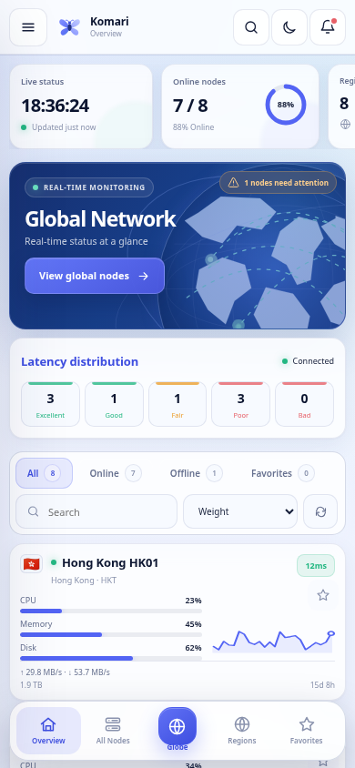

# Komari Butterfly

简体中文 · [English](README.md)

一套参考 WinUI 3 与 Mica 材质设计的简约、响应式 Komari Monitor 主题。


手机端包含可展开搜索命令栏、支持下滑关闭的节点详情、带惯性旋转的全屏交互式地球、安全区与软键盘适配，以及根据滚动方向自动收起和恢复的底部导航。

<p align="center"></p>

移动端细节：[深色界面](docs/preview-mobile-dark.png) · [搜索界面](docs/preview-mobile-search.png) · [小屏布局](docs/preview-mobile-compact.png) · [节点地球](docs/preview-mobile-globe.png) · [节点详情](docs/preview-mobile-drawer.png) · [横屏布局](docs/preview-mobile-landscape.png)

## 主要功能

- 分层 Mica 表面、克制阴影、清晰的 WinUI 状态和五套强调色。
- 深色模式使用统一的深海军蓝色调，不再让搜索框、按钮和节点卡片出现突兀的白色表面。
- 点击首页 **查看全球节点** 打开可拖动地球；在线、部分在线和离线地区分别点亮，并可聚焦地区、查看当地节点和打开节点详情。
- 地区定位只读取两位 ISO 地区代码或字符串开头的旗帜 Emoji，按国家/地区聚合，不推测城市位置。
- 实时指标、延迟分布、区域概览、流量图表、收藏、网格/列表模式和节点详情抽屉。
- 原生接入 Komari JSON-RPC 2.0，运行时不依赖外部 JavaScript、CSS、地图服务或定位服务。
- 可在 Komari 后台管理明暗模式、强调色、信息密度、圆角、背景、刷新间隔、排序、面板显示、文案与页脚。
- 手机端采用紧凑命令栏、横向吸附状态卡、置顶筛选工具栏和随滚动收起的五项底部导航；输入框、下拉框或软键盘激活时，底部导航会主动避让。搜索会直接进入节点结果，实时刷新不会打断输入或重置当前位置。
- 节点详情使用支持下滑关闭的安全区底部抽屉，并压缩为四项指标、双列硬件信息和更短图表；地球采用全屏布局、横向区域卡、带惯性的触屏旋转和低开销绘制。
- 矮屏竖屏设备会进一步缩短概览与地球区域；320 × 568 级别的小屏只隐藏大型主视觉，保留状态卡，并让筛选栏与首个节点避开悬浮底栏。
- 支持快捷键搜索、减少动画偏好、横屏布局，以及简体中文、英语和日语界面。

## 安装

1. 从 GitHub Releases 下载 `komari-butterfly-v1.4.0.zip`。
2. 进入 Komari 管理后台，在主题管理中上传 ZIP。
3. 选择 **Komari Butterfly** 并保存。

发布包根目录保持以下结构：

```text
komari-theme.json
preview.png
dist/
  index.html
  favicon.svg
  assets/
    app.js
    region-data.js
    world-data.js
    styles.css
```

## 本地预览

```bash
npm run build
python3 -m http.server 4173 --directory dist
```

打开 `http://127.0.0.1:4173/?demo=1`。深色预览使用 `?demo=1&theme=dark`，直接打开地球使用 `?demo=1&theme=dark&globe=1`。

演示数据只会在显式添加 `demo=1` 或通过 `file://` 打开页面时启用；接口请求失败时不会自动伪造节点数据。

## 构建、校验与打包

```bash
npm run check
npm run package
```

打包后生成：

```text
release/komari-butterfly-v1.4.0.zip
release/komari-butterfly-v1.4.0.zip.sha256
```

## 发布

更新 `komari-theme.json` 中的 `version`，提交后创建对应标签并推送：

```bash
git tag v1.4.0
git push origin main --tags
```

GitHub Actions 会核对标签与清单版本，构建主题，生成 ZIP 和 SHA256 文件，并将它们附加到 GitHub Release。

## 主题配置

全部配置项都声明在 `komari-theme.json` 中，由 Komari 管理后台统一管理。主题只读取 Komari 公共设置中精确返回的 `theme_settings`，并仅应用清单中已经声明的值。

布局系统和视觉决策见 [设计说明](docs/DESIGN.md)。

## 许可证

MIT © TomorrowX6
